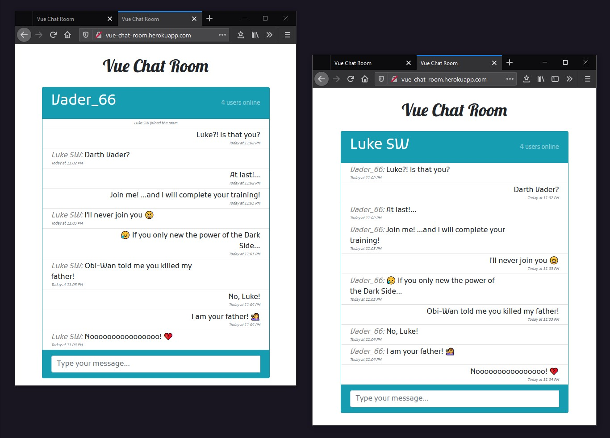

<h1 align="center">
  :love_letter: Vuex Chat Room
</h1>

<p align="center">
  <a href="#trophy-lessons-learned">Lessons Learned</a>&nbsp;&nbsp;&nbsp;|&nbsp;&nbsp;&nbsp;
  <a href="#rocket-technologies--resources">Technologies</a>&nbsp;&nbsp;&nbsp;|&nbsp;&nbsp;&nbsp;
  <a href="#hammer-setting-up-the-environment">Environment Setup</a>&nbsp;&nbsp;&nbsp;|&nbsp;&nbsp;&nbsp;
  <a href="#zap-features">Features</a>
</p>

<p align="center">
  

  

  

  

  
</p>



Simple application developed to learn the **Web Socket** with the `socket.io` abstraction. Completely based on Bitfumes's [video lesson available in YouTube](https://www.youtube.com/watch?v=wYqzv_oxyl8&t=127s).

[Check out the application running!](https://vue-chat-room.herokuapp.com/)

## :trophy: Lessons Learned

- [Socket.io](https://socket.io/);
- Real-time events listeners and emitters:

## :rocket: Technologies & Resources

**Frontend:**
- Vue.js 2
- Bootstrap 4
- Font Awesome 6
- Socket.io client

**Backend:**
- Express
- Socket.io

**Development:**
- Visual Studio Code
- Nodemon & Node.js routines

## :hammer: Setting up the Environment

Make sure to have **Node.js 10+** installed in your machine and its **npm** available in the command line, then use the following routines:

```bash
$ npm install   # Download dependencies
$ npm run watch # Run development server
$ npm start     # Run production server
```

## :zap: Features

- [x] Join the chat room with a displayable name;
- [x] Real-time overview on connections count;
- [x] Send a message to the server;
- [x] See other participants' messages;
- [x] See who's typing;
- [x] See who joined and who left the room;
